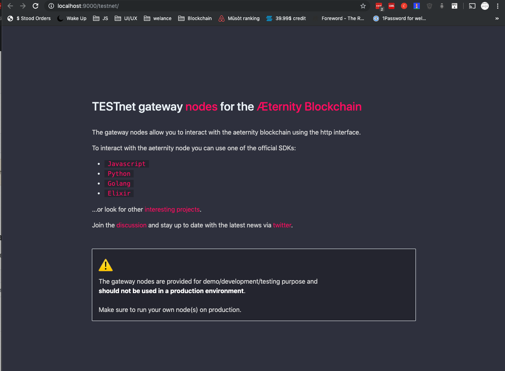

# Aeternity Networks Templates
This is a repository where you can find the "homepages" of the aeternity's Networks

## Usage
- Run `npm i` to install dependencies
- Run `npm run dev` to work on:
  1. `http://localhost:9000/mainnet/`
  2. `http://localhost:9000/testnet/`
- Run `npm run prod` to build assets for production (genearates a `templates` folder)

## Notes for devs
These "homepages" share the same CSS

## Screenshot

